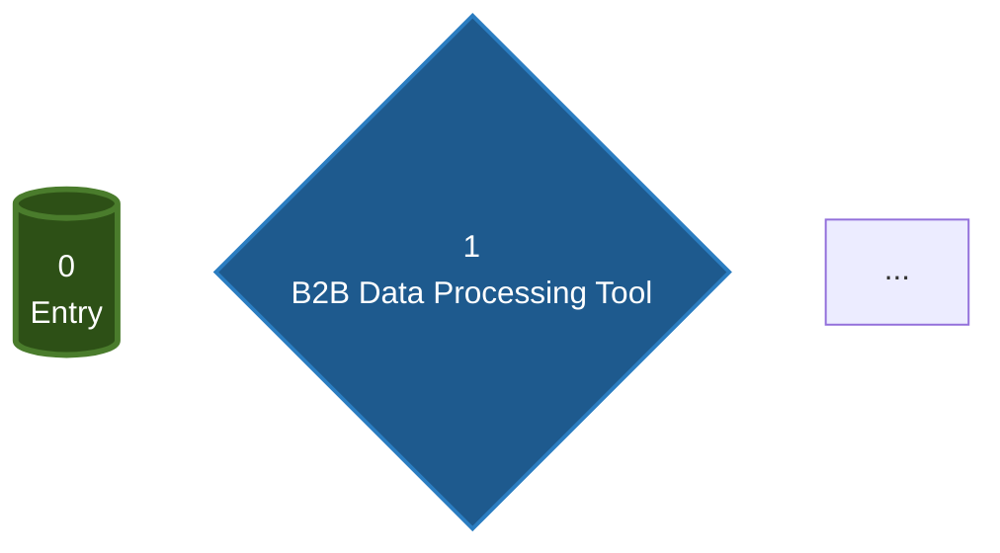

# Graph Slicer

Extract individual tools from a Beam.ai agent graph into separate files with topology-aware naming and automatic Mermaid flowchart generation.

## Purpose

This skill processes Beam.ai JSON files containing graph objects and:
1. **Extracts actual graph topology** - Uses BFS traversal of nodes and edges
2. **Creates level-based file naming** - Files numbered by depth (e.g., `3.1-ToolName.md` for level 3, branch 1)
3. **Generates Mermaid flowcharts** - Visual representation of the agent flow with routing conditions
4. **Enriches tool files with metadata** - Adds description, input/output params, prompts, data types

## Supported Input Formats

The script automatically detects and handles two JSON structures:

### Format 1: Exported JSON (with graphTools array)
```json
[{
  "agent": {...},
  "graph": {
    "nodes": [...],  // Graph topology with childEdges
    ...
  },
  "graphTools": [...],  // Separate tool definitions
  "sampleAgentTasks": [...]
}]
```

### Format 2: Beam API Response (embedded toolConfiguration)
```json
{
  "graph": {
    "nodes": [
      {
        "id": "...",
        "objective": "...",
        "toolConfiguration": {
          "toolName": "...",
          "inputParams": [...],
          "outputParams": [...],
          "originalTool": {
            "prompt": "..."
          }
        },
        "childEdges": [...]
      }
    ]
  }
}
```

When `graphTools` array is empty or missing, the script automatically extracts tool data from each node's embedded `toolConfiguration`, including prompts from `originalTool.prompt`.

## Workflow

### Step 1: Identify Input File

Locate the JSON file containing the graph structure. This can be:
- An exported graph from Beam.ai UI
- A raw API response from `get_agent_graph.py`

### Step 2: Ask User for Output Mode

**Ask the user:** "Which output mode would you like?"
- **markdown** (default) - Human-readable documentation
- **json** - Machine-readable enriched JSON with topology metadata

### Step 3: Ask User for Output Directory

**CRITICAL - ALWAYS ASK:** "Where should I create the nodes/ folder?"
- Default: Same directory as the input file
- User can specify a different path
- **NEVER assume or auto-create without asking!**

**Check for existing files:**
- If `nodes/` folder already exists at the target location, **STOP**
- Warn user: "nodes/ folder already exists at [path]. Files may be overwritten!"
- Ask: "Continue and overwrite? (yes/no)"
- If "no" → Ask for a different output directory
- **NEVER auto-delete files!**

### Step 4: Run the Slicer

Based on user choices, run with the appropriate flags:

#### Markdown Mode (DEFAULT - Recommended)

Creates clean documentation for human reading:

```bash
node 03-skills/graph-slicer/scripts/slice_graph.js <input-file> --markdown --output <output-dir>
```

**If user chose same directory as input file, omit --output flag:**
```bash
node 03-skills/graph-slicer/scripts/slice_graph.js <input-file> --markdown
```

**Output in `nodes/` folder:**
- `GRAPH.md` - High-level overview with:
  - Agent description and statistics
  - Mermaid flowchart (color-coded nodes)
  - Topology summary (indented tree)
  - Node index with links
  - Routing conditions
- Individual node files: `1-ToolName.md`, `2.1-AnotherTool.md`, etc.
  - Description
  - Level and branch info
  - Input parameters (with data types and fill types)
  - Prompt
  - Output parameters (with data types)

**Example markdown output:**
```markdown
# 1 - B2B Data Processing Tool

**Level**: 1
**Branch**: 0
**Tool Name**: B2B Data Processing Tool

## Description

This tool is designed to process and verify company data...

## Input Parameters

**new_customer_json** `string` *(ai_fill)*: Data of a new customer provided...

## Prompt

\`\`\`
## Role
You are a precise data extraction assistant...
\`\`\`

## Output Parameters

**registration_vat_id** `string`: Extract from root level field 'taxId'...
```

#### JSON Mode

Creates enriched JSON with topology metadata:

```bash
node 03-skills/graph-slicer/scripts/slice_graph.js <input-file> --json --output <output-dir>
```

**Output in `nodes/` folder:**
- Individual JSON files: `1-ToolName.json`, `2.1-AnotherTool.json`, etc.
- Each file contains:
  - `_topology` metadata block (level, branch, edges, conditions)
  - Original tool data (prompt, params, config)

**Level numbering (both modes):**
- Level 0 = Entry node
- Level 1 = First processing step
- Level 3.2 = Third level, second branch
- Numbers reflect actual graph depth and branching

### Step 5: Review Generated Files

**Tool files include:**
- `_topology` metadata block with:
  - `level`, `branch`, `levelNumber`
  - `nodeId`, `objective`
  - `onError`, `evaluationCriteria`
  - `incomingEdges` (parent nodes + conditions)
  - `outgoingEdges` (child nodes + conditions)
  - `isExitNode` flag
  - Node timestamps

**GRAPH.md includes:**
- Agent metadata (ID, dates, description)
- Mermaid flowchart with:
  - Color-coded nodes (entry=green, exit=red, router=blue, processor=gold)
  - Edge labels showing routing conditions
  - Branch names
- Topology summary (indented tree view)
- Node index with links to individual files
- Statistics (total nodes, exit points, decision points, max depth)

## Example Output

### Topology Summary
```
0 - Entry Node (1 branches)
  1 - B2B Data Processing Tool (3 branches)
    2.1 - Beam Task URL Generator (1 branches)
    2.2 - Beam Task URL Generator (1 branches)
    2.3 - Logging Assistant [EXIT]
      3.1 - No VAT ID Report Generator (1 branches)
      3.2 - VAT ID Format Determination Tool (2 branches)
        ...
```

### Mermaid Flowchart (in GRAPH.md)


## Notes

**About JSON Structure:**
- Handles nested structures where data is under `data[0]` or `data['0']`
- First tries to match tools via `graphTools` array using `toolFunctionName`
- **Falls back to embedded `toolConfiguration`** when `graphTools` is empty (Beam API responses)
- Extracts prompts from `toolConfiguration.originalTool.prompt`
- Preserves all original tool data while adding topology metadata
- Files are formatted with 2-space indentation for readability

**Graph Metadata Captured:**
- Node connections via `childEdges`
- Routing conditions (business logic)
- Edge names (human-readable labels)
- Error handling strategy per node
- Evaluation criteria
- Creation/update timestamps

**Use Cases:**
- Documenting agent architecture
- Understanding branching logic
- Reviewing routing conditions
- Onboarding new team members
- Debugging agent flow issues
- Preparing for agent modifications

---

## Input Parameter Fill Types

The skill handles three fill types for input parameters, rendering each appropriately:

### Static (`fillType: "static"`)
Parameters with fixed values set in the Beam UI. The markdown output shows:
- The actual `staticValue` content
- For code files (array of `{name, content}` objects): renders with syntax highlighting
- For simple values: shows as inline code
- Description shown as a blockquote below

**Example output:**
```markdown
**language** `string` *(static)*

**Value**: `python`

> Name of the programming language
```

### Linked (`fillType: "linked"`)
Parameters that receive their value from a previous node's output. The markdown output shows:
- The linked parameter name (`linkOutputParam.paramName`)
- Source parameter description
- Example value if available

**Example output:**
```markdown
**stdin** `string` *(linked)*

**Linked to**: `country_tax_rate_array`

> Source parameter description: Return ONLY a valid JSON array...

**Example value**:
\`\`\`json
[{"country":"FINLAND","tax_rate":"25.5","tax_amount":"0.00"}]
\`\`\`
```

### AI Fill (`fillType: "ai_fill"`)
Parameters where the AI determines the value based on instructions. The markdown output shows:
- The AI instructions (from `paramDescription`)
- Example output if available

**Example output:**
```markdown
**tax_details** `string` *(ai_fill)*

**AI Instructions**:

Extract the tax details from the Airtable response...

**Example**:
\`\`\`
{"country": "GERMANY", "tax_rate": "19"}
\`\`\`
```

---

## Changelog

- **v1.2** (2026-01-07): Added fill type aware rendering for input parameters. Static values now show actual content (including code files with syntax highlighting). Linked parameters show source info and examples. AI fill parameters show instructions clearly labeled.
- **v1.1** (2026-01-06): Added fallback to extract tool data from embedded `node.toolConfiguration` when `graphTools` array is empty. Added description section and data type annotations to markdown output. Now works with direct Beam API responses.
- **v1.0** (Initial): Original version supporting exported JSON with `graphTools` array.
