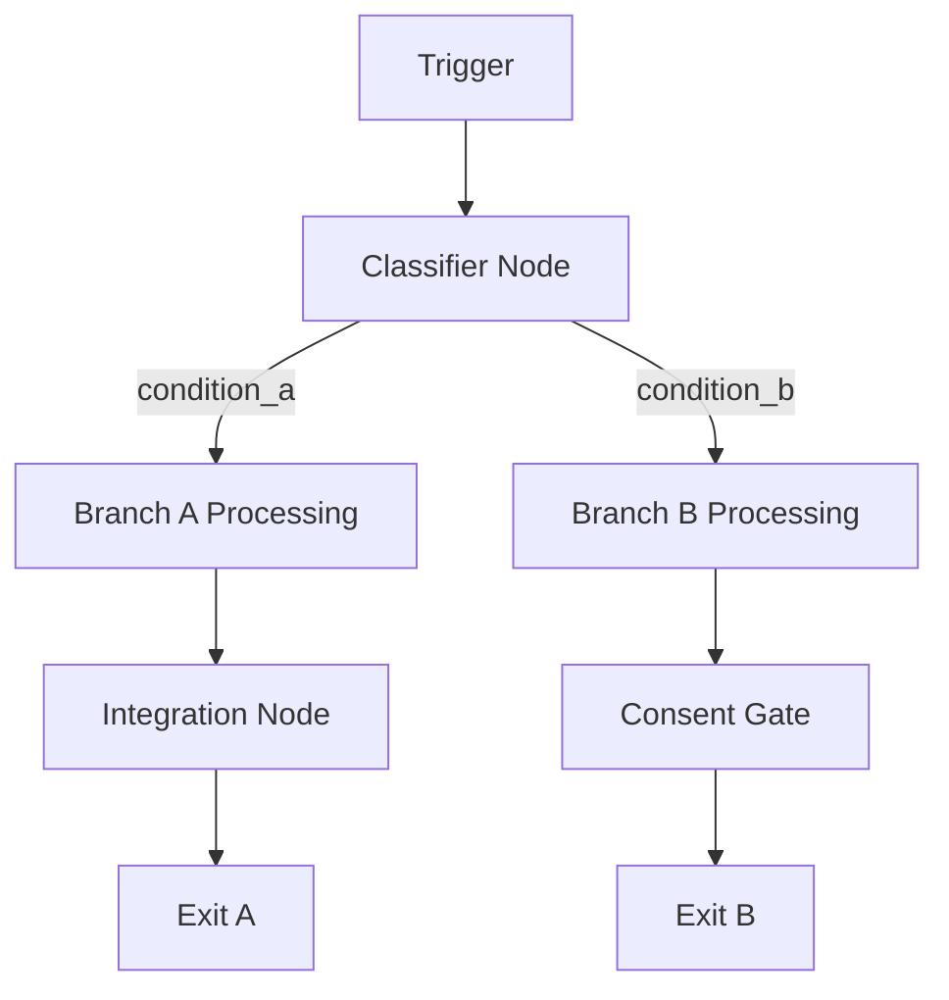

# Build Beam Agent

Design and deploy a complete Beam AI agent from a demo request or requirements document. This skill handles the full lifecycle: understand requirements → design workflow → confirm with user → deploy to Beam.

## When to Use

- Building a new agent demo from a client request (Notion page, PDF, markdown)
- Deploying an agent design to the Beam AI platform
- User says "build beam agent", "create agent from this request", "deploy agent to beam"

## Prerequisites

- Beam API credentials in `.env` (`BEAM_API_KEY`, `BEAM_WORKSPACE_ID`)
- A demo request or requirements document (any format)
- Target Beam workspace ID (from agent URL or user-provided)

---

## Workflow

### Phase 1: Understand Requirements

#### Step 1.1: Gather the Request
- Accept input in any format: Notion URL, PDF, markdown file, pasted text
- If Notion URL: fetch via Notion API (use `NOTION_API_KEY` from `.env`, download attachments)
- If PDF: read and extract content
- If markdown/text: read directly

#### Step 1.2: Analyze and Summarize
Present to the user:
- **Client name** and context
- **What they want** — key capabilities (numbered list)
- **Constraints** — security, human-in-the-loop, integration requirements
- **Integrations** — what systems need to connect

Ask: "Does this capture the request correctly? Anything to add or change?"

#### Step 1.3: Define Agent Scope
Determine with the user:
- How many agents are needed (often capabilities collapse into fewer agents)
- Which capabilities are core vs. nice-to-have
- What's demo scope vs. production scope

**Do NOT proceed until the user confirms the scope.**

---

### Phase 2: Design the Workflow

#### Step 2.1: Draft the Workflow
Design the agent workflow as a **mermaid diagram**. Show:
- Trigger (how the agent is invoked)
- Each processing node with its purpose
- Branching/conditional logic
- Human approval gates (consent nodes)
- Integration nodes (Airtable, Outlook, Gmail, Slack, etc.)
- Exit points

Example format:


#### Step 2.2: Detail Each Node
For each node, specify:
- **Objective** (what the node does — can be long)
- **Tool name** (display name — MUST be ≤40 characters)
- **Type**: GPT tool, integration (Airtable/Outlook/Gmail), or router
- **Input params** (what it receives)
- **Output params** (what it produces)
- **Requires consent**: yes/no (human approval gate)
- **Prompt summary** (2-3 sentences on what the LLM does)

#### Step 2.3: Confirm with User
Present the complete design and ask:
"Here's the full workflow with [N] nodes. Does this look right? Any changes before I build it?"

**Do NOT proceed to deployment until the user confirms the design.**

---

### Phase 3: Build and Deploy

#### Step 3.1: Prepare the Agent
- If agent already exists on Beam: get the agent ID and workspace ID from the user
- If new agent needed: create via `POST /agent-graphs/complete`

#### Step 3.2: Build the Graph Payload
Follow these **mandatory rules** (from BEAM-AGENT-BUILDING-GUIDE.md):

##### Tool Names
- **Max 40 characters**. Shorten if needed.
- The node objective (description) can be longer.

##### Prompts — Curly Brace Rules
- **Parameter references**: Use `` ```{param_name}``` `` (triple backticks + single curly braces)
- **Literal curly braces** (JSON examples): Use `{{double_braces}}`
- **Every input param must be referenced in the prompt** — unreferenced params aren't passed to the LLM
- Single `{anything}` NOT in triple backticks → **task will fail at runtime**

##### Input Params (required fields)
```json
{
  "fillType": "ai_fill",
  "position": 0,
  "required": true,
  "dataType": "string",
  "paramName": "param_name",
  "paramDescription": "What this param contains",
  "outputExample": "example value",
  "reloadProps": false,
  "remoteOptions": false
}
```
- `reloadProps` and `remoteOptions` are **mandatory booleans** — omitting causes 400

##### Output Params (required fields)
```json
{
  "isArray": false,
  "paramName": "output_name",
  "position": 0,
  "paramDescription": "What this outputs",
  "dataType": "string",
  "outputExample": "example"
}
```
- `isArray` is **mandatory** — omitting causes validation error
- Use `enum` type with `typeOptions.enumValues` for classification outputs

##### Edges
- `condition` must be a **string**, never null — use empty string `""` for unconditional
- For conditional branching: use `conditionGroups` with enum-based rules in the UI, or string conditions in the API

##### Entry Node
- The trigger/entry node is for input source configuration only (webhook, email trigger)
- Add a **separate GPT tool node** after it for any classification/processing logic
- Do NOT put LLM prompts on the entry node

#### Step 3.3: Deploy
1. **Initial creation**: Use `PUT /agent-graphs/{agentId}` to push the full graph
2. **Prompt updates**: Use `PATCH /agent-graphs/{agentId}/nodes/{nodeId}/prompt` per node (safer — doesn't touch edges/conditions)
3. **Integration nodes** (Airtable, Outlook, etc.): Create with correct `toolFunctionName` but note that integration connections must be configured in the Beam dashboard by the user

#### Step 3.4: Verify
- Fetch the graph back via `GET /agent-graphs/{agentId}`
- Verify: node count, edges, prompts populated, consent gates set
- Print a summary table showing all nodes with their status

#### Step 3.5: Integration Setup Instructions
Tell the user what they need to configure in the Beam dashboard:
- Which integration nodes need connections (Airtable, Outlook, Gmail, etc.)
- Base IDs, table IDs, or other config values they'll need
- Any Airtable tables that need to be created (offer to create via API)

---

### Phase 4: Test

#### Step 4.1: Generate Sample Inputs
Create 2-3 sample inputs that test different branches:
- One for each conditional path
- Realistic data matching the client's domain

#### Step 4.2: Run Test Task
```python
POST /agent-tasks
Body: {"agentId": "...", "taskQuery": {"query": "sample input text"}}
```

#### Step 4.3: Monitor and Report
- Poll `GET /agent-tasks/{taskId}` for status
- Report which nodes completed, which failed, and any errors
- If consent gates are hit, notify user to approve in dashboard

---

## API Reference

### Authentication
```python
# Exchange API key for token
POST /auth/access-token
Body: {"apiKey": "your_api_key"}
Response: {"idToken": "...", "refreshToken": "..."}

# Headers for all requests
Authorization: Bearer {idToken}
current-workspace-id: {workspace_id}
Content-Type: application/json
```

### Key Endpoints

| Action | Method | Endpoint |
|--------|--------|----------|
| Create agent + graph | POST | `/agent-graphs/complete` |
| Update full graph | PUT | `/agent-graphs/{agentId}` |
| Get agent graph | GET | `/agent-graphs/{agentId}` |
| Update node prompt | PATCH | `/agent-graphs/{agentId}/nodes/{nodeId}/prompt` |
| Update node params | PATCH | `/agent-graphs/{agentId}/nodes/{nodeId}/input-output-params` |
| Add node | POST | `/agent-graphs/add-node` |
| Add edge | POST | `/agent-graphs/add-edge` |
| Create task | POST | `/agent-tasks` |
| Get task status | GET | `/agent-tasks/{taskId}` |
| Approve consent | POST | `/agent-tasks/execution/{taskId}/user-consent` |

### Workspace ID
- Extract from agent URL: `https://app.beam.ai/{workspaceId}/{agentId}/flow`
- Or ask user for it
- **Not** the same as `BEAM_WORKSPACE_ID` in `.env` (that may be a different workspace)

### Common Integration Tool Function Names

| Integration | Action | toolFunctionName |
|-------------|--------|-----------------|
| Airtable | Create record | `AirtableAction_RecordCreate` |
| Airtable | Update record | `AirtableAction_RecordUpdate` |
| Airtable | Get records | `AirtableAction_GetRecords` |
| Outlook | Send email | `MicrosoftOutlookAction_MessageSend` |
| Outlook | Draft reply | `MicrosoftOutlookAction_DraftMessageReply` |
| Gmail | Send email | `GmailAction_SendEmail` |
| Gmail | Draft email | `GmailAction_DraftEmail` |
| Slack | Send message | `SlackAction_SendMessage` |

---

## Common Gotchas Checklist

Before deploying, verify:
- [ ] All tool names ≤ 40 characters
- [ ] All prompts use `` ```{param}``` `` for parameter refs (not bare `{param}`)
- [ ] All JSON examples in prompts use `{{double_braces}}`
- [ ] All input params have `reloadProps: false` and `remoteOptions: false`
- [ ] All output params have `isArray` field set
- [ ] All edge `condition` fields are strings (not null)
- [ ] Entry node has no LLM prompt — separate classifier node exists after it
- [ ] Every input param is referenced in its node's prompt
- [ ] Consent gates are set on nodes requiring human approval
- [ ] Integration nodes use correct `toolFunctionName`

---

## Output

After completing this skill:
- Agent deployed on Beam AI (draft mode)
- All GPT nodes have prompts with parameter references
- Integration nodes identified (user configures connections in dashboard)
- Sample test inputs provided
- Agent design documentation saved in `04-workspace/AgentDemos/{client-name}/`

---

## Related Skills

- **design-beam-agent** — Design-only (markdown specs, no deployment)
- **agent-request-documentation** — Generate delivery docs comparing request vs. built agent
- **beam-debug-issue-tasks** — Debug failed agent tasks
- **demo-documentation-generation-agent** — Generate documentation from agent graph

---

## References

- [Beam Agent Building Guide](../AgentDemos/BEAM-AGENT-BUILDING-GUIDE.md) — Full best practices reference
- [Beam API Docs](https://docs.beam.ai/08-reference/api/overview/overview)
- [Beam API OpenAPI Spec](https://docs.beam.ai/openapi-final.json)

---

**Version**: 1.0
**Created**: 2026-03-29
**Source**: Built from experience deploying the SGO Correspondence Brief & Response Agent
